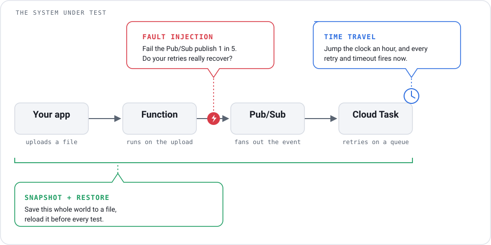

<p align="center">
  
</p>

# CloudRig

### A local Google Cloud environment for realistic, deterministic integration testing.

<p align="center">
  <a href="https://github.com/monirz/cloudrig/actions/workflows/ci.yml"></a>
  <a href="https://codecov.io/gh/monirz/cloudrig"></a>
  <a href="https://scorecard.dev/viewer/?uri=github.com/monirz/cloudrig"></a>
  <a href="https://pkg.go.dev/github.com/monirz/cloudrig"></a>
  <a href="https://github.com/monirz/cloudrig/releases"></a>
  <a href="LICENSE"></a>
</p>

**Use it locally or in CI.** Run real GCP clients against a deterministic local
environment — no GCP project or credentials required.

```text
                         CloudRig
                            │
       ┌────────────────────┼────────────────────┐
       │                    │                    │
       ▼                    ▼                    ▼
   GCP Services         Real Workloads       Test Controls
       │                    │                    │
       │                    │              ┌─────┼─────┐
       │                    │              ▼     ▼     ▼
 Storage / PubSub       Functions/GKE    Time  Fault  Fork
 Firestore / Tasks      Cloud Run
 Scheduler / Secrets
       │
       └────────── Connected Event-Driven ──────────┘
```

---

## At a Glance

Start it, deploy a function, call it. CloudRig's own CLI:

```sh
cloudrig start &
# cloudrig v0.1.0 listening on http://127.0.0.1:4599
# health: http://127.0.0.1:4599/_emu/health

cloudrig fn deploy hello --source ./testdata/go-hello
# deployed projects/cloudrig-local/locations/us-central1/functions/hello (go, Handler)
# url: http://localhost:4599/us-central1-cloudrig-local/hello

curl http://localhost:4599/us-central1-cloudrig-local/hello
# {"hello":"cloudrig"}
```

The same function through **unmodified `gcloud`**, once `cloudrig-env.sh` points
it at the emulator:

```sh
. ./cloudrig-env.sh
# gcloud -> http://localhost:4599 (project cloudrig-local)

gcloud functions list
# NAME   STATE   TRIGGER       REGION       ENVIRONMENT
# hello  ACTIVE  HTTP Trigger  us-central1  1st gen

gcloud functions call hello --region us-central1
# executionId: dlk4rq45ewmw-1
# result: |
#   {"hello":"cloudrig"}
```

No project, no credentials, no network. The same is true of `terraform`,
`kubectl` and the Google client libraries.

---

## Test Controls

Provoke the failures, delays, and starting conditions a test needs, all against
one live pipeline:

<p align="center">
  
</p>

```sh
cloudrig fault pubsub --error 503 --failure-rate 0.2
# armed: pubsub → error 503, 20% of requests  (/google.pubsub.v1.)

cloudrig clock advance 1h
# clock: virtual  now: 2026-09-20T13:07:33Z  pending: 0

cloudrig snapshot seed.tar
# saved snapshot to seed.tar
```

Make a dependency flake and prove your retries hold; fire every scheduled job,
retry and TTL without waiting; save a seeded world and reload it before each
test. Time travel needs `cloudrig start --clock virtual`, which freezes the
clock so `clock advance` can move it.

More: [fault injection](docs/fault-injection.md), [time travel](docs/time-travel.md),
and [snapshot and restore](docs/snapshot.md).

---

## Integration Testing in CI

You are not mocking GCP. You are giving every CI job — and every developer who
has to reproduce its failure — the same environment, seeded the same way.

### 1. Zero-config startup

```sh
cloudrig start
```

Tests point at it through the standard emulator variables — no project, no
service account, no `gcloud auth`.

### 2. Deterministic isolation

Each CI job gets its own CloudRig instance, so jobs never contend for state:

```text
Job 1 → CloudRig A
Job 2 → CloudRig B
Job 3 → CloudRig C
```

In Go, that granularity drops to one instance per *test* —
[`cloudrig.MustStart(t)`](docs/in-process-testing.md) starts an isolated
emulator in-process, on its own port, torn down by `t.Cleanup`.

### 3. Snapshot and fork

Seed expensive state once, then branch it per case:

```text
             seed
              │
          snapshot
        ┌─────┼─────┐
        ↓     ↓     ↓
      test1 test2 test3
```

A fork copies metadata and **hardlinks** object payloads, so branching a
hundred gigabytes of objects costs the size of the metadata. Store contents,
armed faults and the virtual clock all travel, and each is copied rather than
shared — travelling time in one fork leaves the others where they were.

### Failure reproduction

A snapshot is a file. When an integration test fails in CI, upload the snapshot
as a build artifact; whoever picks up the bug restores it and gets the exact
world the failure happened in, down to the clock reading and the armed faults.

```sh
cloudrig snapshot failure.tar   # in CI, on test failure
cloudrig restore failure.tar    # on a laptop, an hour later
# restored
```

More: [in-process testing](docs/in-process-testing.md), [fork state](docs/fork-state.md).

---

## Install

Pick one. All three put a `cloudrig` binary on your PATH.

**Prebuilt binary (no Go needed).** Downloads the release for your OS and CPU,
on macOS and Linux:

```sh
VERSION=v0.1.0
OS=$(uname -s | tr '[:upper:]' '[:lower:]')                 # darwin or linux
ARCH=$(uname -m); [ "$ARCH" = x86_64 ] && ARCH=amd64; [ "$ARCH" = aarch64 ] && ARCH=arm64
curl -sSL "https://github.com/monirz/cloudrig/releases/download/$VERSION/cloudrig_${VERSION#v}_${OS}_${ARCH}.tar.gz" | tar -xz cloudrig
sudo mv cloudrig /usr/local/bin/
```

On macOS the binary is unsigned, so clear the quarantine flag once:
`xattr -d com.apple.quarantine /usr/local/bin/cloudrig`.

**With Go (1.25 or newer):**

```sh
go install github.com/monirz/cloudrig/cmd/cloudrig@latest
```

**From source:**

```sh
git clone https://github.com/monirz/cloudrig && cd cloudrig
make build              # produces ./cloudrig
```

---

## Quick Start

Start CloudRig and point `gcloud` at your local GCP:

```sh
cloudrig start &
curl -sSO https://raw.githubusercontent.com/monirz/cloudrig/main/cloudrig-env.sh
. ./cloudrig-env.sh          # points gcloud at CloudRig, with no credentials
```

If you installed from source, `cloudrig-env.sh` is already in the checkout, so
skip the `curl` line.

Now use it exactly like the real thing:

```sh
gcloud storage buckets create gs://demo
# Creating gs://demo/...

gcloud storage cp README.md gs://demo/
gcloud storage ls gs://demo
# gs://demo/README.md
```

Point the client libraries at the same port with the standard emulator
variables:

```sh
export PUBSUB_EMULATOR_HOST=localhost:4599
export FIRESTORE_EMULATOR_HOST=localhost:4599
```

From here: [provision it with Terraform](#provision-with-terraform),
[run a workload on GKE](#run-a-workload-on-gke), or watch
[a whole pipeline run](#see-it-in-action-events-time-travel-faults-and-state).

---

## Provision with Terraform

The `google` provider works unmodified. Two lines in the provider block are the
whole trick — `access_token` skips credentials, and each service gets its own
endpoint override:

```hcl
provider "google" {
  access_token            = "cloudrig-local"
  storage_custom_endpoint = "http://localhost:4599/storage/v1/"
}
```

**Apply a stack of Storage and Pub/Sub resources** against the running emulator
([`examples/terraform/services/`](examples/terraform/services/)):

```sh
terraform -chdir=examples/terraform/services init
terraform -chdir=examples/terraform/services apply -auto-approve
# Apply complete! Resources: 5 added, 0 changed, 0 destroyed.
#
# Outputs:
# object_url = "http://localhost:4599/storage/v1/b/tf-bucket/o/hello.txt?alt=media"

curl "$(terraform -chdir=examples/terraform/services output -raw object_url)"
terraform -chdir=examples/terraform/services plan      # no changes
terraform -chdir=examples/terraform/services destroy -auto-approve
```

Create, update in place and destroy all work, and a second `plan` is clean —
so the same Terraform you ship can be exercised end to end in CI.

**Provision a real Kubernetes cluster.** This stack is slower and needs a
container runtime plus k3d or kind, so it is kept separate
([`examples/terraform/gke/`](examples/terraform/gke/)):

```sh
terraform -chdir=examples/terraform/gke init
terraform -chdir=examples/terraform/gke apply -auto-approve   # real cluster, ~1 min
terraform -chdir=examples/terraform/gke plan                  # no changes
terraform -chdir=examples/terraform/gke destroy -auto-approve
```

`apply` goes through the emulated GKE admin API and spins an actual local
cluster. Full walkthrough: [Terraform guide](docs/services.md#terraform).

---

## Run a Workload on GKE

`gcloud container clusters create` starts a **real** local Kubernetes cluster —
k3s via k3d, or kind — not a stub. Install a backend first
(`brew install k3d`), then:

```sh
gcloud container clusters create demo --location=us-central1 --num-nodes=1
gcloud container clusters list --location=us-central1
# NAME  LOCATION  MASTER_VERSION  MASTER_IP      MACHINE_TYPE  ...  STATUS
# demo                            0.0.0.0:57166                    RUNNING
```

`gcloud container` is the admin API CloudRig emulates. `kubectl` talks to the
cluster itself, so point it at the backend's own kubeconfig — not the one
gcloud writes, which expects a Google auth plugin the local cluster cannot
satisfy. The backend cluster carries a generated suffix, so look it up:

```sh
export KUBECONFIG=$(k3d kubeconfig write "$(k3d cluster list | awk '/^cloudrig-demo/{print $1}')")

kubectl create deployment web --image=nginx
kubectl wait --for=condition=available deployment/web --timeout=120s
kubectl get pods
# NAME                   READY   STATUS    RESTARTS   AGE
# web-68d995574f-4dtbk   1/1     Running   0          39s
```

That pod is running on a real cluster — anything that runs *on* Kubernetes
works. Tear it down with
`gcloud container clusters delete demo --location=us-central1`.

Full walkthrough, including kind and the auth split: [GKE guide](docs/services.md#gke).

---

## See It in Action: Events, Time Travel, Faults and State

One workflow with all three controls on it: an object landing in a bucket
triggers a function that publishes to Pub/Sub, a worker enqueues a Cloud Task,
and fast-forwarding the clock fires its retries — with Pub/Sub made to flake
underneath, and the seeded world saved and reloaded around the whole run. Run
it with [`examples/pipeline/run.sh`](examples/pipeline/run.sh), or step
through it:

```sh
# Start CloudRig with a virtual clock. It points functions at its own services
# automatically; SINK_URL is this app's own setting.
SINK_URL=http://localhost:8080/ cloudrig start --clock virtual &
. ./cloudrig-env.sh

# Provision a bucket, a Pub/Sub topic, and a task queue.
gcloud storage buckets create gs://intake
curl -X PUT localhost:4599/v1/projects/cloudrig-local/topics/orders -d '{}'
gcloud tasks queues create pipeline --location=us-central1 --max-attempts=3

# Deploy the pipeline: ingest (storage -> Pub/Sub), worker (Pub/Sub -> Cloud Task).
cloudrig fn deploy ingest --source ./examples/pipeline/ingest --trigger-bucket intake
cloudrig fn deploy worker --source ./examples/pipeline/worker --trigger-topic orders

# Save the seeded world. Every case below can start from exactly here.
cloudrig snapshot seed.tar
# saved snapshot to seed.tar

# Make Pub/Sub flake on half its requests, so the retry path is the path taken.
cloudrig fault pubsub --error 503 --failure-rate 0.5
# armed: pubsub → error 503, 50% of requests  (/google.pubsub.v1.)

# Drop an object in. It flows through the whole chain and enqueues a task.
echo '{"id":42}' > order.json
gcloud storage cp order.json gs://intake/
#   sink: task attempt

# Fast-forward time. The task fires and retries, deterministically.
cloudrig clock advance 1h
#   sink: task attempt      <- the retries, with no real waiting
#   sink: task attempt
# clock: virtual  now: 2026-09-20T13:26:34Z  pending: 0

# Disarm the fault and roll the world back for the next case.
cloudrig fault clear
cloudrig restore seed.tar
# cleared all faults
# restored
```

Every stage is real: the functions run as processes, Pub/Sub and Cloud Tasks are
live, the clock is injected so the retries need no real waiting, and the
snapshot carries the store, the armed faults and the clock reading together —
so the next case starts from the same world, not a similar one.

---

## Why CloudRig?

- **Connected and event-driven.** A storage write triggers a function; a
  scheduler job publishes to Pub/Sub which triggers another. One local CloudRig
  environment, with connected services sharing the same emulator state.
- **Deterministic.** Time is injected, so a test reproduces exactly, with no
  flaky `time.Sleep`s.
- **Built for testing.** [Travel through time](docs/time-travel.md),
  [inject failures](docs/fault-injection.md), and [fork state](docs/fork-state.md).
- **Real clients.** `gcloud`, Terraform, `kubectl` and the Google client
  libraries work unchanged, over gRPC and REST.

---
## How To

- [Run CloudRig](docs/cli.md)
- [Use `gcloud`](docs/services.md#use-it-from-gcloud)
- [Connect a GCP client](docs/services.md#pubsub)
- [Create a Pub/Sub workflow](docs/services.md#run-a-function-on-a-pubsub-message)
- [Deploy and trigger a Function](docs/services.md#run-a-function)
- [Use Cloud Storage triggers](docs/services.md#upload-a-file-run-a-function)
- [Use Cloud Tasks](docs/services.md#cloud-tasks)
- [Use Scheduler](docs/services.md#cloud-scheduler)
- [Run GKE workloads](docs/services.md#gke)
- [Use Terraform / OpenTofu](docs/services.md#terraform)
- [Configure CloudRig](docs/configuration.md)
- [Run CloudRig in CI](docs/in-process-testing.md)

---

## Supported Services

CloudRig emulates the following services:

| Service | Status | Notes |
|---|:--:|---|
| Cloud Functions | ✅ | Real local execution (Go & Node), HTTP & event triggers |
| Cloud Storage | ✅ | Buckets, objects, uploads, versioning, signed URLs |
| Pub/Sub | ✅ | Publish, streaming pull, ack/nack, redelivery |
| Firestore | ✅ | Documents, queries, transactions, over gRPC |
| Cloud Tasks | ✅ | Deferred HTTP work, dispatched on the clock |
| Cloud Scheduler | ✅ | Cron jobs firing HTTP or Pub/Sub, on the clock |
| Secret Manager | ✅ | Secrets, versions, the `latest` alias |
| Cloud Logging | ✅ | Write and read structured entries with a filter |
| Service Usage | ✅ | `gcloud services enable/disable/list` |
| Cloud Run | ✅ | Runs a real container (needs Docker) |
| GKE | ✅ | Real local Kubernetes (needs k3d or kind) |

Full compatibility and limitations: [service guides](docs/services.md) ·
[what's not supported](UNSUPPORTED.md).

---

## Testing

- [Time Travel](docs/time-travel.md): fast-forward the clock; scheduled work fires instantly.
- [Fault Injection](docs/fault-injection.md): inject errors, latency, and timeouts over REST and gRPC.
- [Fork State](docs/fork-state.md): branch a seeded environment per test case.
- [Snapshot and Restore](docs/snapshot.md): save a running emulator's state to a file and load it back.
- [In-Process Testing](docs/in-process-testing.md): one isolated emulator inside each Go test.

---

## Tutorials

- [Build your first Function](docs/services.md#run-a-function)
- [Build an event-driven application](docs/services.md#upload-a-file-run-a-function)
- [Build a Storage → Function → Pub/Sub workflow](docs/services.md#run-a-function-on-a-pubsub-message)
- [Build a complete multi-service application](docs/services.md)
- [Terraform + CloudRig](docs/services.md#terraform)
- [GKE + CloudRig](docs/services.md#gke)

---

## Guides

- [Time Travel](docs/time-travel.md)
- [Fault Injection](docs/fault-injection.md)
- [Fork State](docs/fork-state.md)
- [Snapshot and Restore](docs/snapshot.md)
- [In-Process Testing](docs/in-process-testing.md)
- [Configuration](docs/configuration.md)
- [Authentication](docs/authentication.md)
- [Networking](docs/networking.md)

---

## Architecture

How CloudRig serves every service on one port, with an injected clock:
[ARCHITECTURE.md](ARCHITECTURE.md).

---

## CLI Reference

Every subcommand and flag: [docs/cli.md](docs/cli.md).

---

## Development

```sh
git clone https://github.com/monirz/cloudrig && cd cloudrig
make build              # -> ./cloudrig
make check              # build, vet, lint, gofmt, tests
```

See [CONTRIBUTING.md](CONTRIBUTING.md) for conventions.

---

## Roadmap

Planned services, distribution, and testing features: [ROADMAP.md](ROADMAP.md).

---

## Contributing

Contributions, bug reports and ideas are welcome. See
[CONTRIBUTING.md](CONTRIBUTING.md).

---

## Support

If CloudRig saves you time, you can buy me a coffee. Recent messages appear
below, updated automatically.

<!--START_SECTION:buy-me-a-coffee-->
<!--END_SECTION:buy-me-a-coffe-->

---

## License

MIT. See [LICENSE](LICENSE).
